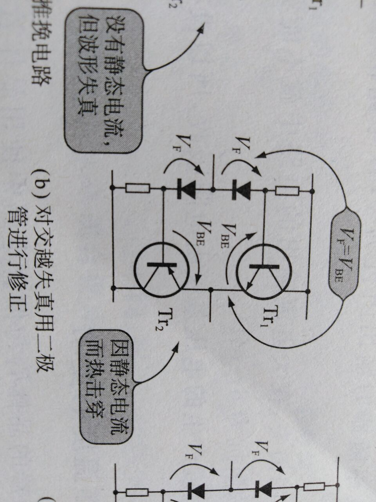

# Demo2

## 链接 demo
### 内嵌式链接
- 外部链接 [百度](http://www.baidu.com)

- 内部链接1, 链接仓库的其它文件 ：[demo1](demo1.md)  
- 内部链接2，链接本文档的其它文件 :[代码块 demo](demo2.md#代码块-demo)

### 引用式链接

- 外部链接 [百度](http://www.baidu.com)
- 内部链接1, 链接仓库的其它文件 ：[demo1]
- 内部链接2，链接本文档的其它文件 :[代码块 demo]

## 图片demo
 ! [alt] (url text)

 ! [baidu] (http://www.baidu.com “百度网站”)
 
- 仓库内的图片 demo
   
 
 
 -图片的引用链接demo
  ![][picture_open]
  
## 引用demo
> 这是个引文  

出自《背影》
>>>这是多重引文   

## 代码块demo

'''  c++  

int a=9;  

int &b=a;

'''

[百度]:http://www.baidu.com
[demo1]:demo1.md 
[代码块 demo]:demo2.md#代码块-demo
[picture_open]:images/eletronic.jpg
